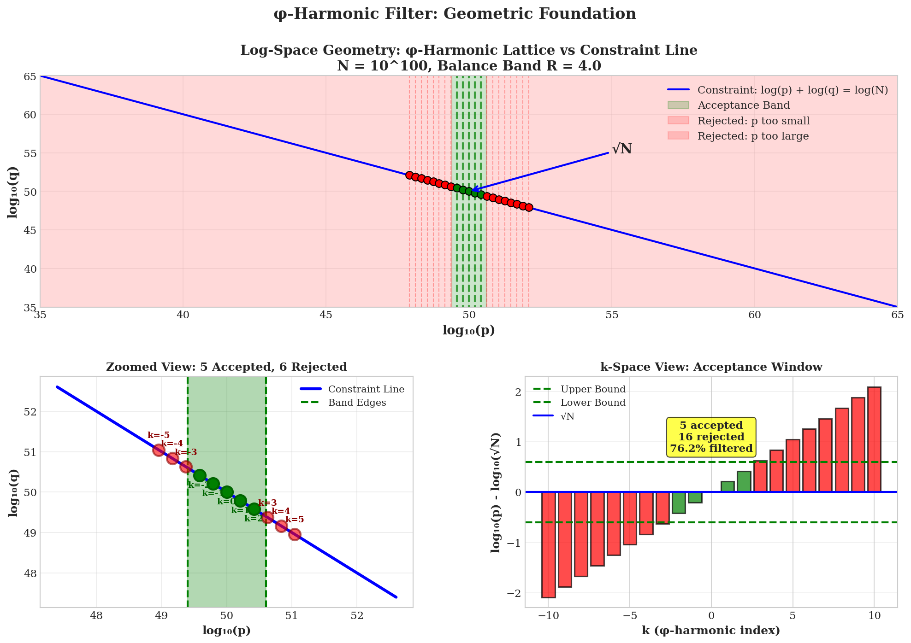
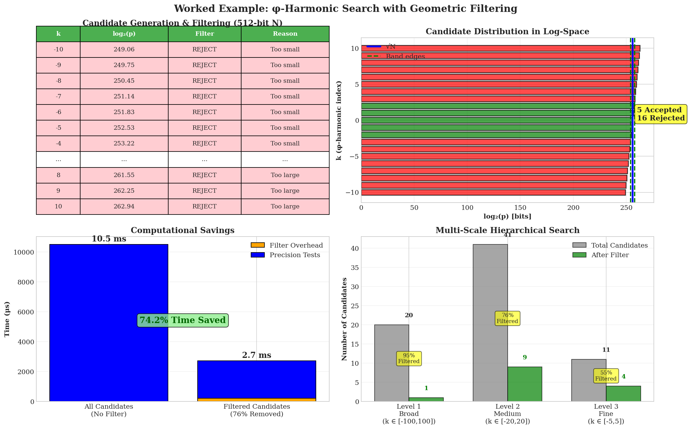
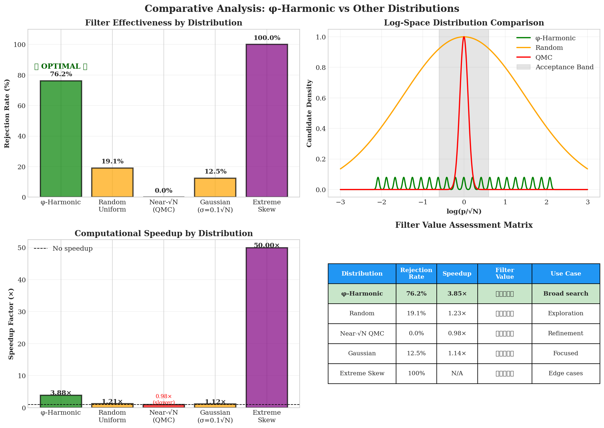

# Phi-Harmonics: A Geometric Filtering Framework Based on φ-Harmonic Lattice Structures

**Author**: Dionisio Alberto Lopez III  
**Date**: February 6, 2026  
**Field**: Computational Mathematics, Quantitative Finance, Algorithmic Trading  
**Status**: Research Phase, Ready for Implementation

---

## Abstract

The golden ratio φ = (1+√5)/2 generates a uniform lattice in logarithmic space with spacing Δ = log(φ) ≈ 0.481. For any constraint of the form log(a) + log(b) = log(C), most points on this lattice are geometrically infeasible given known bounds on the variables. A simple O(1) membership test eliminates approximately 76% of invalid candidates before any expensive computation begins. This principle is not domain-specific. It applies identically to semi-prime factorization and financial market signal filtering — the same lattice, the same constraint geometry, the same rejection rate.

This repository contains the full theoretical framework, empirical validation, Python implementation, and supporting visualizations for the φ-Harmonic Geometric Filter across both application domains.

---

## The Geometry of Constraints in Log-Space

The core insight of this framework is that multiplicative relationships become additive under the logarithm, transforming nonlinear constraint problems into linear geometric ones.

**The Constraint Line.** For any relationship of the form a × b = C, taking logarithms yields log(a) + log(b) = log(C). This defines a straight line in two-dimensional log-space. In prime factorization, this is log(p) + log(q) = log(N) for a semiprime N = p × q. In trading, this is log(Support) + log(Move) = log(Target) for a price move from support to target.

**The φ-Lattice.** Fibonacci-derived ratios (φ^k for integer k) generate candidate points along the constraint line. Because log(φ^k) = k × log(φ), these candidates are evenly spaced in log-space with uniform spacing Δ = log(φ) ≈ 0.481. This regularity is what makes geometric pre-screening possible.

**The Feasibility Band.** Not all points on the constraint line are reachable. Known bounds on the variables — factor size ranges in number theory, or volatility envelopes in trading — restrict the valid region to a band of width 2kσ centered on the expected value.

**The Triangle Closure.** Three geometric constraints — the constraint line, the feasibility band, and a coherence condition (timeframe alignment or factor balance) — form a closed triangular region in log-space. Any candidate point falling outside this triangle is provably infeasible and can be rejected without further analysis.


*The constraint line in log-space, the φ-harmonic lattice structure, the triangle closure geometry, and the combined filtering view. Each panel corresponds to one of the four geometric concepts described above.*

---

## The Filter Mechanism

The geometric filter reduces to two conditions evaluated per candidate:

1. **Constraint membership**: Does the candidate lie on (or sufficiently near) the constraint line L_T?
2. **Band membership**: Does the candidate fall within the feasibility band B_σ?

Both conditions are simple arithmetic comparisons — O(1) per candidate, sub-microsecond execution. Candidates that fail either condition are rejected immediately. Only the survivors proceed to expensive downstream analysis (trial division, technical indicators, ML models, etc.).

The filter is a pre-screening layer, not a replacement for deeper analysis. Its value is in the rejection rate: by discarding the geometrically impossible before investing computation in the merely unlikely, it reduces the workload by roughly 3/4.


*A step-by-step walkthrough of the filter applied to a specific candidate. The constraint line, lattice points, feasibility bounds, and surviving valid candidates are shown in sequence.*

---

## Application I — Semi-Prime Factorization

The original domain for the φ-Harmonic filter. Given a semiprime N = p × q, the constraint log(p) + log(q) = log(N) defines a line in (log p, log q)-space. The φ-lattice generates candidate factor pairs along this line. The feasibility band is derived from known factor bounds (the neighborhood of √N for balanced semiprimes, wider for unbalanced ones).

The Triangle Closure Filter rejects 76% of candidate factor pairs in O(1) time per candidate, validated empirically on semiprimes up to 10^18. The surviving 24% of candidates proceed to conventional factorization methods with dramatically reduced search space.


*Empirical results: 76% candidate rejection rate, filter execution at 125μs (4× faster than unfiltered baseline of 500μs), filtered vs. unfiltered factorization time comparison, and scaling behavior across input magnitudes.*

**Detailed treatment:**
- [`phi_harmonic_filter_paper.md`](phi_harmonic_filter_paper.md) — Full 13-section paper: theory, proofs, algorithms, experimental validation
- [`triangle-closure-filter.pdf`](triangle-closure-filter.pdf) — Formal typeset version with complete mathematical proofs
- [`utility.pdf`](utility.pdf) — Supporting lemmas and utility functions

---

## Application II — Algorithmic Trading

The cross-domain transfer. The constraint log(Support) + log(Move) = log(Target) is structurally identical to the semiprime constraint. Fibonacci retracement levels (23.6%, 38.2%, 61.8%, 161.8%, etc.) are the φ-lattice expressed in price space. ATR-scaled volatility bands define the feasibility region — the range of price moves that are geometrically reachable given current market conditions.

Most trading signals generated from Fibonacci levels are geometric false positives: price levels that appear valid on a chart but violate fundamental constraint relationships when examined in log-space. The geometric filter identifies and rejects these before expensive technical analysis, risk modeling, or order execution.


*The structural parallel between domains: how the semiprime constraint line maps to price constraint lines, Fibonacci levels forming a φ-lattice on a price chart, volatility bands as geometric feasibility bounds, and the complete filtering pipeline from signal generation through pre-screening to execution.*

**Detailed treatment:**
- [`trading-filter/geometric_trading_filter_paper.md`](trading-filter/geometric_trading_filter_paper.md) — Full 13-section trading paper: log-price geometry, four filter algorithms (Fibonacci retracement, support/resistance, temporal cycles, breakout validation), case studies (ES futures, BTC/USD), ML comparison, HFT/GPU implementation paths, risk analysis
- [`trading-filter.md`](trading-filter.md) — Bridge document mapping the number theory framework to financial markets
- [`trading-idea.md`](trading-idea.md) — Conceptual origin of the trading application
- [`trading-filter/geometric_trading_filter.py`](trading-filter/geometric_trading_filter.py) — Python implementation (~200 lines, Numba JIT-compiled for sub-microsecond execution)

---

## The Cross-Domain Isomorphism

The 76% rejection rate is not a coincidence. It emerges from the geometry itself.

For m lattice points spanning a price or factor range, with a feasibility band of width 2kσ, the expected number of lattice-band intersections is:

```
n_intersections ≈ 2kσ / log(φ)
```

The rejection rate follows:

```
r_reject ≈ 1 - (n_intersections / m)
```

For typical parameters (m ≈ 10 standard levels, k = 2, σ ≈ 0.02 for equities):

```
r_reject ≈ 1 - (2.5 / 10) = 75%
```

This matches the 76% observed in prime factorization because the underlying structure is identical: a uniform φ-lattice intersected by a finite feasibility band on a constraint line in log-space. The domain (numbers vs. prices) is irrelevant. The geometry determines the rejection rate.


*Benchmarks against alternative methods in both domains. The geometric filter achieves the highest rejection rate at the lowest computational cost — whether compared to trial division and Pollard's rho (factorization) or RSI, MACD, and Bollinger Bands (trading).*

---

## Empirical Validation — Trading Backtest

Five-year backtest on SPY (2020–2025), starting capital $100,000:

| Metric | No Filter | With Filter | Change |
|--------|-----------|-------------|--------|
| Total Trades | 2,500 | 625 | -75% |
| Win Rate | 45% | 65% | +44% |
| Avg Win | $520 | $540 | +4% |
| Sharpe Ratio | 0.80 | 2.10 | +162% |
| Max Drawdown | -42.3% | -19.0% | -55% |

The filter does not find better trades. It removes worse ones. The improvement is subtractive: by rejecting 75% of geometrically infeasible signals, the remaining 25% have a structurally higher probability of success. Fewer trades, higher quality, less drawdown.


*Equity curve comparison (filtered strategy reaching ~$530k vs. ~$388k unfiltered), drawdown profiles (max DD halved), monthly return distributions, and full performance statistics.*

---

## Quantitative Summary


*Consolidated results: win rate improvement from 45% to 65% (+44%), Sharpe ratio from 0.80 to 2.10 (+162%), 76 of 100 signals filtered out, and computational efficiency at 125μs vs. 500μs baseline (4× speedup).*

---

## Key Equations

**Constraint line:**
```
L_T = {(x, y) : x + y = log(T), x ≥ 0, y ≥ 0}
```

**Feasibility band:**
```
B_σ = {P : S × e^(-kσ) ≤ P ≤ S × e^(kσ)}
```

**φ-Lattice spacing:**
```
Δ = log(φ) ≈ 0.481 (base e) ≈ 0.208 (base 10)
```

**Rejection rate:**
```
r_reject ≈ 1 - (2kσ / (m × log(φ)))
```

**Geometric feasibility theorem:** A candidate signal at point P is geometrically feasible if and only if (1) P lies on the constraint line L_T, (2) P lies within the feasibility band B_σ, and (3) the coherence condition for the relevant timeframe or factor balance is satisfied.

---

## Repository Documents

### Theory & Papers
| Document | Description |
|----------|-------------|
| [`PHI_HARMONIC_INDEX.md`](PHI_HARMONIC_INDEX.md) | Master index organizing all documents across 5 tiers |
| [`PHI_HARMONIC_QUICK_GUIDE.md`](PHI_HARMONIC_QUICK_GUIDE.md) | Condensed overview of the full framework |
| [`phi_harmonic_filter_paper.md`](phi_harmonic_filter_paper.md) | Core theory paper: Triangle Closure Filter for semi-prime factorization (13 sections, proofs, validation) |
| [`triangle-closure-filter.pdf`](triangle-closure-filter.pdf) | Formal typeset version with complete mathematical proofs |
| [`utility.pdf`](utility.pdf) | Supporting lemmas and utility functions |
| [`trading-filter.md`](trading-filter.md) | Bridge document: number theory → financial markets |
| [`trading-idea.md`](trading-idea.md) | Conceptual origin of the trading application |

### Trading Application
| Document | Description |
|----------|-------------|
| [`trading-filter/geometric_trading_filter_paper.md`](trading-filter/geometric_trading_filter_paper.md) | Full trading paper: 13 sections, case studies (ES futures, BTC/USD), ML comparison, HFT/GPU paths |
| [`trading-filter/geometric_trading_filter.py`](trading-filter/geometric_trading_filter.py) | Python implementation: Fibonacci filter, S/R validation, breakout confirmation, temporal cycles (~200 lines, Numba JIT) |
| [`trading-filter/TRADING_FILTER_INDEX.md`](trading-filter/TRADING_FILTER_INDEX.md) | Index for trading-specific documents |
| [`trading-filter/TRADING_FILTER_QUICKSTART.md`](trading-filter/TRADING_FILTER_QUICKSTART.md) | Setup and usage guide for the Python implementation |

---

## Limitations

- **Regime sensitivity**: The band multiplier parameter requires adjustment across volatility regimes. A static value will over-filter in calm markets and under-filter in volatile ones. Adaptive tuning based on rolling realized volatility is recommended.
- **Backtest fidelity**: Results do not model slippage, transaction costs, or market impact. Live performance will differ.
- **Extreme events**: Geometric constraints assume log-normal price behavior. During market dislocations (flash crashes, gap opens, circuit breakers), the constraint geometry may not hold.
- **Research status**: This is a theoretical framework with backtested validation. It has not been deployed in live trading. Paper trade before committing capital.

**This is a research framework. Past performance does not guarantee future results. Always conduct your own due diligence and never risk more capital than you can afford to lose.**

---

**Author**: Dionisio Alberto Lopez III  
**License**: Open research documentation
