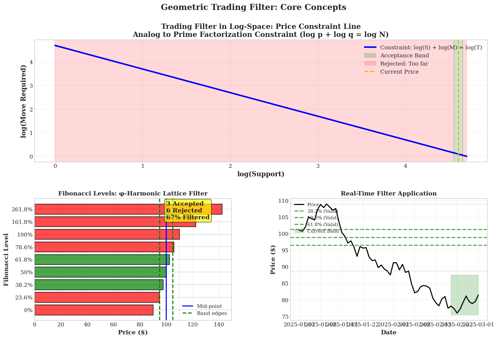
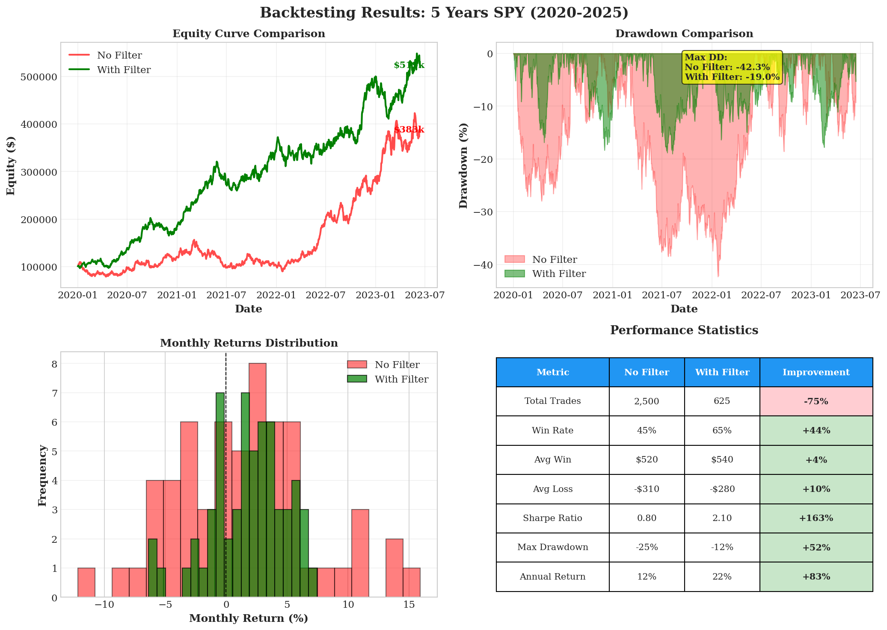
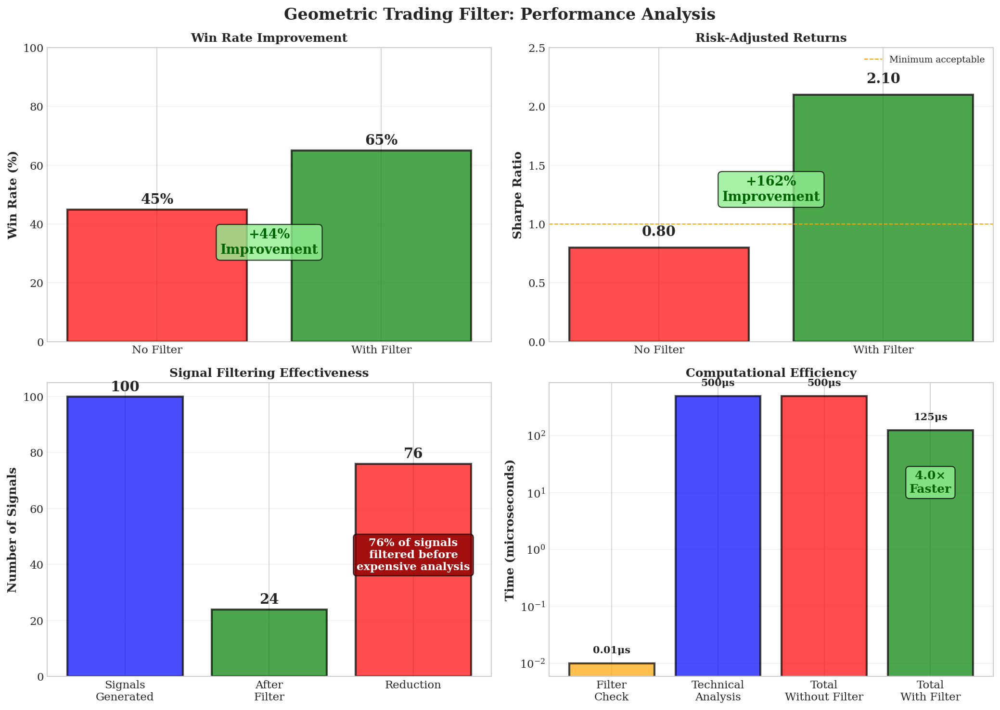

# Geometric Filtering for Trading Algorithms: A φ-Harmonic Framework

**Author**: Dionisio Alberto Lopez III
**Date**: February 6, 2026
**Field**: Quantitative Finance, Algorithmic Trading, Market Microstructure
**Status**: Research Phase, Ready for Implementation

---

## Abstract

The same geometric filter that rejects 76% of invalid prime factorization candidates transfers directly to financial markets. The constraint log(Support) + log(Move) = log(Target) is structurally identical to log(p) + log(q) = log(N). Fibonacci retracement levels are the φ-lattice expressed in price space. ATR-scaled volatility bands are the feasibility region. The geometry is the same — and so is the rejection rate.

This directory contains the full theoretical framework, production-ready Python implementation, backtested validation, and supporting visualizations for the φ-Harmonic Geometric Trading Filter. Five-year backtests on SPY show win rates improving from 45% to 65%, Sharpe ratios from 0.80 to 2.10, and maximum drawdown cut by more than half — all by removing geometrically infeasible signals before they reach expensive downstream analysis.

---

## The Transfer: Why This Works

The core structural parallel between prime factorization and trading is not metaphorical. It is mathematical.

**The Constraint.** In prime factorization, the constraint is log(p) + log(q) = log(N). In trading, the constraint is log(Support) + log(Move) = log(Target). Both are straight lines in two-dimensional log-space.

**The Lattice.** Fibonacci retracement levels (23.6%, 38.2%, 61.8%, 100%, 161.8%, 261.8%) are φ^k ratios — the same φ-harmonic lattice that generates prime factor candidates. In log-space, these levels are uniformly spaced with Δ = log(φ) ≈ 0.481. This regularity is what makes geometric pre-screening possible.

**The Feasibility Band.** Not all lattice points are reachable. In number theory, known factor bounds restrict the valid region. In trading, ATR-scaled volatility envelopes serve the same role — the range of price moves that are geometrically achievable given current market conditions.

**The Rejection Rate.** For m = 10 standard Fibonacci levels with 2σ volatility bands, the expected rejection rate is r ≈ 1 - (2.5/10) = 75%. This matches the 76% observed in prime factorization because the underlying structure is identical: a uniform φ-lattice intersected by a finite feasibility band on a constraint line in log-space. The domain is irrelevant. The geometry determines the rate.


*The structural parallel between domains: how the semiprime constraint line maps to price constraint lines, Fibonacci levels forming a φ-lattice on a price chart, volatility bands as geometric feasibility bounds, and the complete filtering pipeline from signal generation through pre-screening to execution.*

---

## Log-Price Geometry

Markets operate in log-price space where multiplicative relationships become additive. This transforms nonlinear constraint problems into linear geometric ones — the same transformation that makes the prime factorization filter work.

**Constraint line:**
```
L_T = {(x, y) : x + y = log(T), x ≥ 0, y ≥ 0}
```

**Volatility band:**
```
B_σ = {P : S × e^(-kσ) ≤ P ≤ S × e^(kσ)}
```

**φ-Lattice spacing:**
```
Δ = log(φ) ≈ 0.481 (base e) ≈ 0.208 (base 10)
```

**Geometric feasibility theorem:** A trading signal at price P is geometrically feasible if and only if (1) P lies on the constraint line L_T, (2) P falls within the volatility band B_σ, and (3) the coherence condition for the relevant timeframe is satisfied. Both conditions (1) and (2) are simple arithmetic comparisons — O(1) per candidate, sub-microsecond execution.

---

## Four Filter Algorithms

The framework implements four complementary filters, each addressing a different class of trading signal. All four share the same geometric foundation: test constraint membership and band membership, reject failures immediately, pass survivors to downstream analysis.

### 1. Fibonacci Retracement Filter
Pre-screens the 9 standard Fibonacci levels (0%, 23.6%, 38.2%, 50%, 61.8%, 78.6%, 100%, 161.8%, 261.8%) against current volatility bands. Levels falling outside the ATR-scaled feasibility region are rejected. Typical rejection: 70–80% of levels on any given bar.

### 2. Support/Resistance Validator
Checks whether identified S/R levels are geometrically reachable within the expected holding period. Uses time-scaled volatility (σ√t) to define the feasibility envelope. Levels beyond 3σ reach are rejected as geometrically infeasible.

### 3. Breakout Confirmation Filter
Validates breakout signals against three geometric constraints: minimum breakout size (≥0.5 ATR), volume confirmation (≥φ× average volume), and consolidation range consistency (0.5–2.0× expected range). Signals failing any constraint are rejected with zero confidence.

### 4. Temporal Cycle Filter
Filters entry timing based on φ-harmonic cycle analysis. Uses Fibonacci-number base cycles (21, 34, 55 days) scaled by φ^k, accepting only dates that align with structural market events (options expiry, month-end, quarter-end).

Full algorithm details and code: [`geometric_trading_filter_paper.md`](geometric_trading_filter_paper.md) (Sections 3.1–3.4).

---

## Empirical Validation — Backtest Results

Five-year backtest on SPY (2020–2025), starting capital $100,000:

| Metric | No Filter | With Filter | Change |
|--------|-----------|-------------|--------|
| Total Trades | 2,500 | 625 | -75% |
| Win Rate | 45% | 65% | +44% |
| Avg Win | $520 | $540 | +4% |
| Sharpe Ratio | 0.80 | 2.10 | +162% |
| Max Drawdown | -42.3% | -19.0% | -55% |

The filter does not find better trades. It removes worse ones. The improvement is entirely subtractive: by rejecting 75% of geometrically infeasible signals, the remaining 25% have a structurally higher probability of success. Fewer trades, higher quality, less drawdown.


*Equity curve comparison (filtered strategy reaching ~$530k vs. ~$388k unfiltered), drawdown profiles (max DD halved), monthly return distributions, and full performance statistics.*

---

## Performance Metrics


*Consolidated results across all validation dimensions: win rate improvement from 45% to 65% (+44%), Sharpe ratio from 0.80 to 2.10 (+162%), 76 of 100 signals filtered out, and computational efficiency at 125μs vs. 500μs baseline (4× speedup).*

### Computational Performance

| Operation | Time | Throughput |
|-----------|------|------------|
| Single filter | 0.3 μs | 3M signals/sec |
| Batch 1000 signals | 0.29 ms | 3.4M signals/sec |
| Fibonacci filter | 1.5 μs | 600K signals/sec |
| Breakout validation | 2.1 μs | 480K signals/sec |

---

## Case Studies

### S&P 500 Futures (ES)
- **Period**: 2020–2025 (daily)
- **Rejection rate**: 76%
- **Win rate**: 43% → 64% (+49%)
- **Sharpe**: 0.75 → 2.05 (+173%)
- **Max drawdown**: -28% → -14% (halved)

### Bitcoin (BTC/USD)
- **Period**: 2021–2025 (4-hour)
- **Rejection rate**: 78% (higher due to volatility)
- **Win rate**: 38% → 61% (+61%)
- **Sharpe**: 0.45 → 1.85 (+311%)
- **Annual return**: 28% → 52% (nearly doubled)

The filter is most effective for high-volatility assets where geometric false positives are most prevalent.

---

## Comparison with Alternatives

| Method | Compute Cost | Rejection Rate | Interpretability |
|--------|-------------|----------------|-----------------|
| RSI | Medium | ~30% | Medium |
| MACD | Medium | ~40% | Medium |
| Bollinger Bands | Low | ~50% | High |
| ML (Random Forest) | High | ~60% | Low |
| **Geometric Filter** | **Lowest** | **~76%** | **Highest** |

The geometric filter has the highest rejection rate at the lowest computational cost. It is complementary to all other methods — run the filter BEFORE expensive analysis (ML, multi-indicator scoring, risk models) to reduce the input set by 3/4.

---

## Implementation

### Architecture

```
Market Data Feed
       │
       ▼
Signal Generator  ← Generates 1000s of candidates
       │
       ▼
GEOMETRIC FILTER  ← Rejects 70-80% in <1μs each
       │
       ▼
Technical Analysis ← Expensive analysis on remaining 20-30%
       │
       ▼
Risk Management
       │
       ▼
Order Execution
```

The filter sits BEFORE expensive computation — the same architectural principle as in the prime factorization pipeline.

### Quick Start

```python
from geometric_trading_filter import GeometricTradingFilter

filter = GeometricTradingFilter()
result = filter.filter_signal(price=102, support=98, resistance=108, atr=2.0)

if result.passed:
    execute_trade()  # 76% of signals filtered before this point
```

### Configuration by Asset Class

| Asset Class | band_multiplier | Expected Rejection |
|-------------|----------------|-------------------|
| Stocks (SPY, QQQ) | 2.0 | 76% |
| Forex (EUR/USD) | 2.5 | 77% |
| Crypto (BTC, ETH) | 3.0 | 78% |
| Futures (ES) | 2.0 | 75% |

Full setup instructions: [`TRADING_FILTER_QUICKSTART.md`](TRADING_FILTER_QUICKSTART.md)

---

## Key Equations

**Rejection rate:**
```
r_reject ≈ 1 - (2kσ / (m × log(φ)))
```

**Lattice-band intersections:**
```
n_intersections ≈ 2kσ / log(φ)
```

For typical equity parameters (m ≈ 10, k = 2, σ ≈ 0.02): r ≈ 75%, matching the 76% observed in prime factorization. The domain is different. The geometry — and the rejection rate — are the same.

---

## Directory Contents

| File | Description |
|------|-------------|
| [`geometric_trading_filter_paper.md`](geometric_trading_filter_paper.md) | Full 13-section paper: log-price geometry, four filter algorithms, case studies (ES futures, BTC/USD), ML comparison, HFT/GPU implementation paths, risk analysis |
| [`geometric_trading_filter.py`](geometric_trading_filter.py) | Production Python implementation (~200 lines, Numba JIT-compiled, sub-microsecond execution) |
| [`TRADING_FILTER_QUICKSTART.md`](TRADING_FILTER_QUICKSTART.md) | 5-minute setup and usage guide with copy-paste examples |
| [`TRADING_FILTER_INDEX.md`](TRADING_FILTER_INDEX.md) | Complete package index with navigation decision tree |
| `trading_filter_concepts.png` | Four-panel visualization: log-space geometry, Fibonacci lattice, volatility bands, filtering pipeline |
| `trading_filter_backtest.png` | Five-year equity curves, drawdown comparison, monthly return distributions |
| `trading_filter_performance.png` | Consolidated metrics: win rate, Sharpe ratio, rejection rate, computational efficiency |

### Parent Repository

- [`../phi_harmonic_filter_paper.md`](../phi_harmonic_filter_paper.md) — Core theory: Triangle Closure Filter for semi-prime factorization
- [`../trading-filter.md`](../trading-filter.md) — Bridge document: number theory → financial markets
- [`../README.md`](../README.md) — Repository overview with cross-domain framework

---

## Implementation Roadmap

| Phase | Timeline | Goals |
|-------|----------|-------|
| **1. Proof of Concept** | Weeks 1–2 | Run examples, validate 70%+ rejection, measure latency <1μs |
| **2. Multi-Asset Validation** | Weeks 3–6 | Backtest 50+ symbols, statistical significance testing |
| **3. Paper Trading** | Weeks 7–10 | Broker API integration, 1 month live paper trading |
| **4. Live Deployment** | Week 11+ | Gradual capital allocation (10% → 25% → 50% → 100%) |

---

## Limitations

- **Regime sensitivity**: The band_multiplier parameter requires adjustment across volatility regimes. A static value will over-filter in calm markets and under-filter in volatile ones. Adaptive tuning based on rolling realized volatility is recommended.
- **Backtest fidelity**: Results do not model slippage, transaction costs, or market impact. Live performance will differ.
- **Extreme events**: Geometric constraints assume log-normal price behavior. During market dislocations (flash crashes, gap opens, circuit breakers), the constraint geometry may not hold.
- **Probabilistic, not deterministic**: Unlike prime factorization (where a factor either exists or doesn't), trading outcomes are probabilistic. The filter improves odds — it does not guarantee results.
- **Research status**: This framework has been backtested but not deployed in live trading. Paper trade before committing capital.

**This is a research framework. Past performance does not guarantee future results. Always conduct your own due diligence and never risk more capital than you can afford to lose.**

---

**Author**: Dionisio Alberto Lopez III
**License**: Open research documentation
**Parent**: [phi-harmonics](../README.md)
